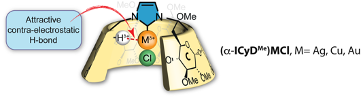

# Welcome to "Mapping coordination space for the C-H•••M interactions in (a-ICyDMe)Au, Ag, Cu complexes reveals “contra-electrostatic H-bonds” masquerading as anagostic interactions"

A repository for the geometries (xyz files) from the paper "Mapping coordination space for the C-H•••M interactions in (a-ICyDMe)Au, Ag, Cu complexes reveals “contra-electrostatic H-bonds” masquerading as anagostic interactions".

For more information, please read our paper on [ChemRxiv](https://chemrxiv.org/).

## Data
* **Coordinates in .xyz format**
    * data/...: coordinates of all CH4-Metal-NHC complexes.
    * data/...: coordinates of full systems.

