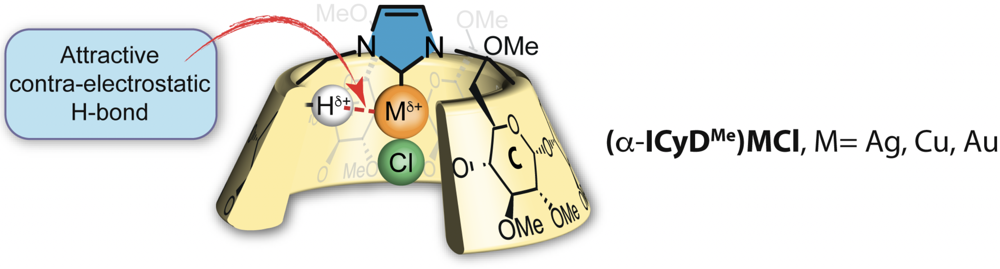

# Welcome to repository for the paper "Mapping the coordination space for C-H•••M interactions in confined spaces: (α-ICyDMe)Au, Ag, Cu complexes reveal “contra-electrostatic H-bonds” masquerading as anagostic interactions"

This is a simple repository for the geometries (xyz files) from the paper "Mapping the coordination space for C-H•••M interactions in confined spaces: (α-ICyDMe)Au, Ag, Cu complexes reveal “contra-electrostatic H-bonds” masquerading as anagostic interactions".

For more information, please read our paper on [ChemRxiv](https://chemrxiv.org/).

## Data
* **Coordinates in .xyz format**
    * SI_data/H3C-H_M-NHC_systems: coordinates of all CH4-Metal-NHC complexes.
    * SI_data/full_systems: coordinates of full systems.

